## Instalar AWS EMR Paso por paso

1. Buscar el servicio de Amazon EMR y crear un cluster.
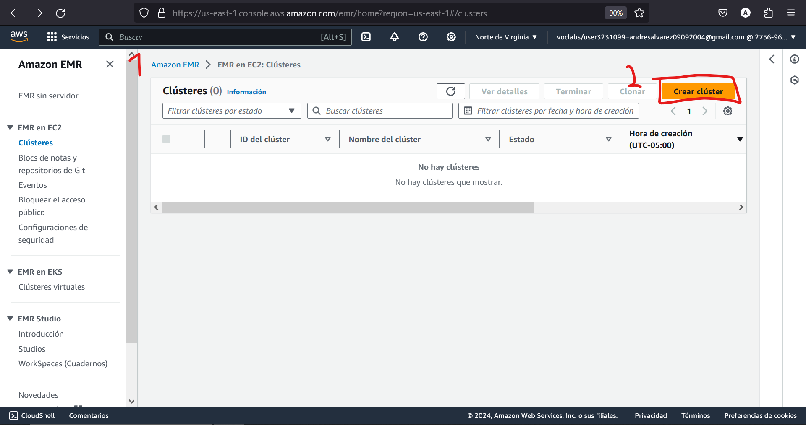
2. Escogemos el nombre, version y el bundle de la aplicacion custom, luego seleccionamos las opciones que aparecen con el check azul.
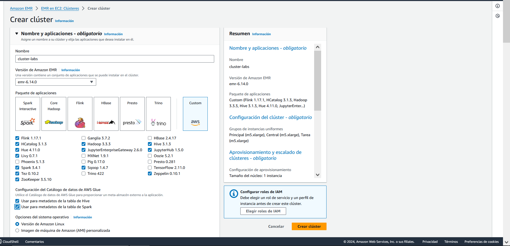
3. En el grupo de instancia escogemos las m5.xlarge que son las recomendadas
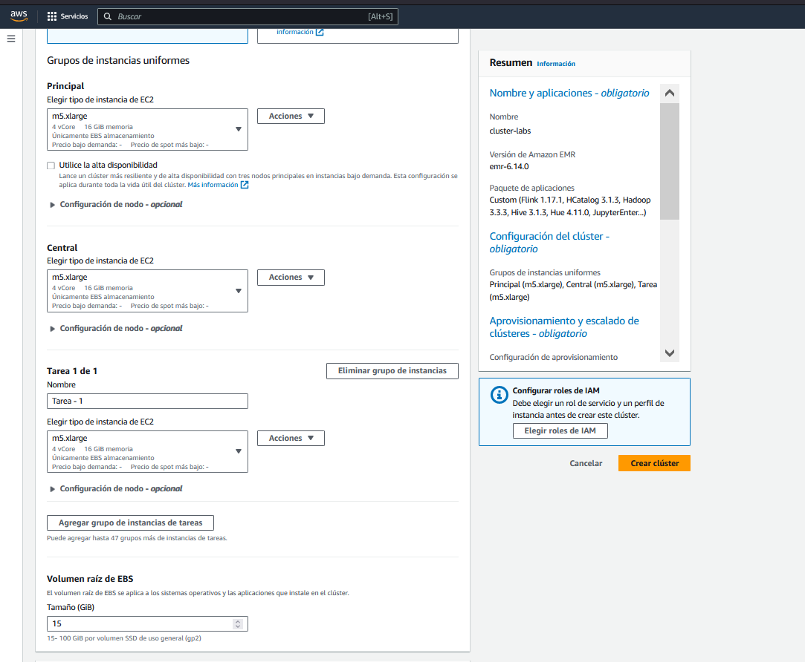
4. En configuracion de aprovisionamiento y redes lo dejamos por defecto y las configuraciones subsiguientes hasta el apartado de `Configuraciones de software` donde debemos ajustar unos detalles
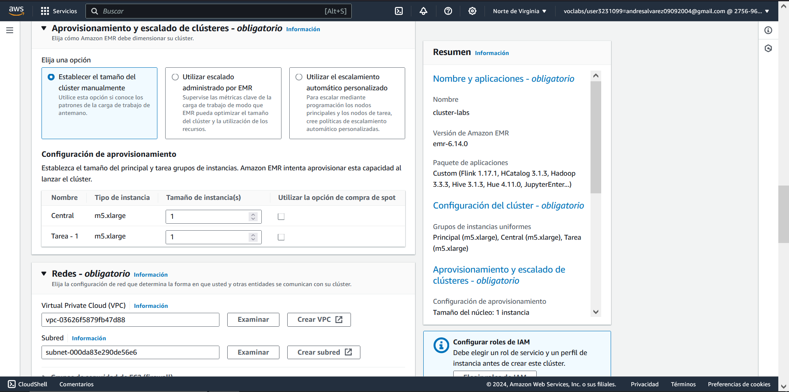
5. Configurar software settings, esto para configurar el bucket para guardar los notebooks jupyter de modo que no se pierdan cuando se borre el cluster EMR. El nombre del bucket debe ser unico y no debe tener mayusculas.
Se pega la siguiente configuracion: 
```
[
    {
        "Classification": "jupyter-s3-conf",
        "Properties": {
            "s3.persistence.enabled": "true",
            "s3.persistence.bucket": "camilobucket-labs-telematica"
        }
    }
]
```
En aws se ve de la siguiente forma:
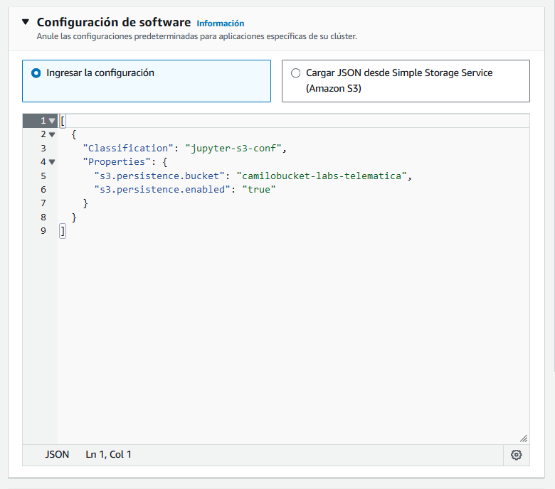

6. En la configuracion de seguridad por defecto, llave par de EC2 se escoge `vockey` que es la de por defecto de AWS, en IAM Roles seleccionar:

* Service role: EMR_DefaultRole
* Instance profile: EMR_EC2_DefaultRole
* Customautomatic scaling role: LabRole

Se ve de la siguiente forma todo:

  6.1.
    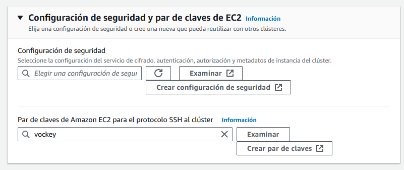

  6.2.
    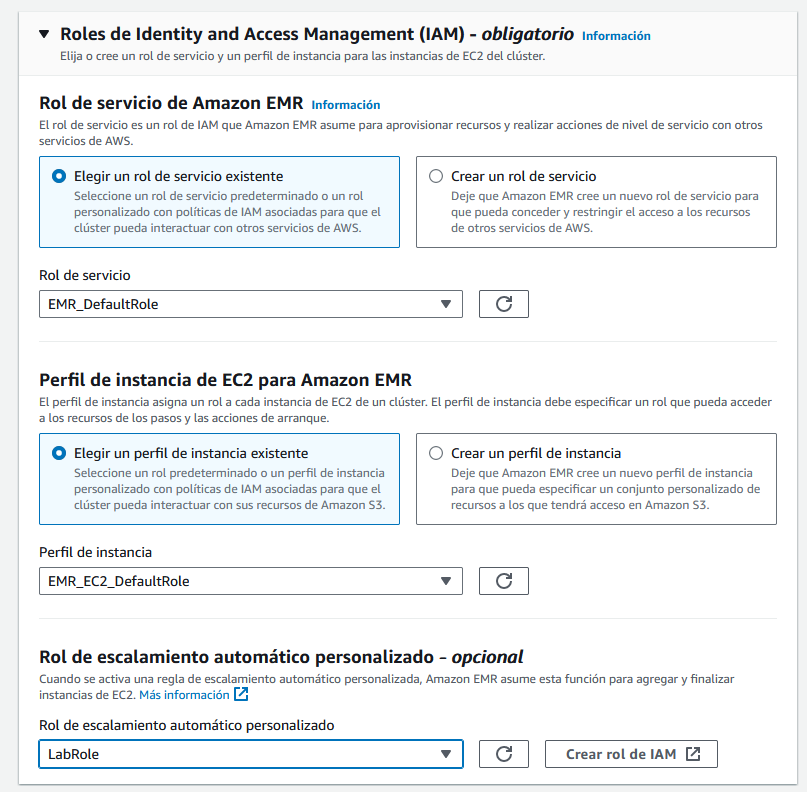

7. Finalmente seleccionaremos el boton de crear cluster.
Se debe esperar hasta que aparezca lo siguiente:
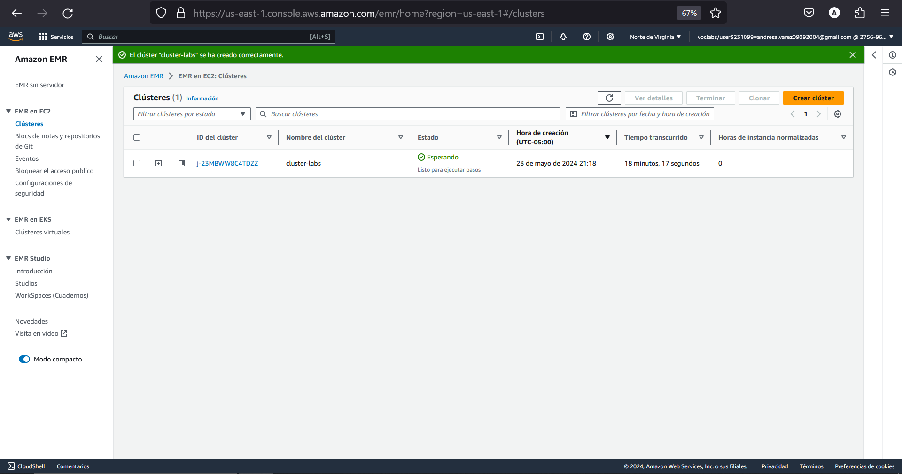

8. Entramos al cluster nos dirigimos al apartado bloquear acceso publico y lo vamos a editar, aqui vamos a desactivar el bloqueo que viene por defecto
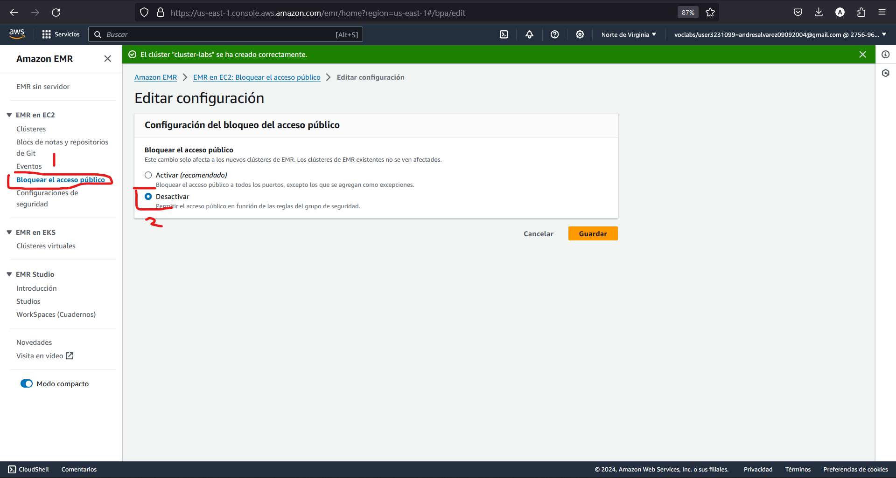
9. Ahora en el grupo de seguridad del nodo Master del cluster debemos habilitar algunos puertos.
| (nota: como estas configuraciones se reutilizan al crear, destuir, clonar un cluster, entonces los puertos ya quedan abiertos).

    Se necesitan habilitar lo siguientes puertos: 8888, 9443, 8890, 22, 14000,  9870. 
    
    Por temas practicos yo voy habilitar todo el trafico.

    Para hacer esto nos dirigimos al panel de EC2: 

    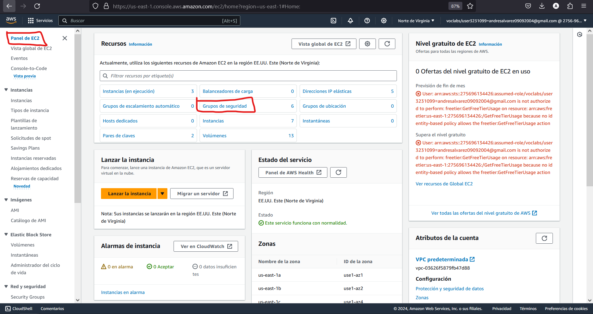

    Ingresamos a grupo de seguridad y seleccionamos el grupo con el nombre `ElasticMapReduce-master`. Una vez dentro de daremos en `Editar reglas de entrada`.

    En este apartado vamos habilitar todo el trafico tal como se ve en la siguiente imagen.

    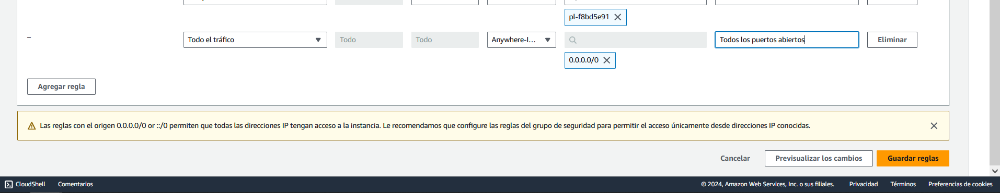
    Y guardaremos los cambios.

    | Tener en cuenta que los clusters EMR son temporales y que no se deben pausar, cada que no se requieran se deben terminar. Luego para iniciar el ambiente de trabajo de nuevo se debe Clonar el cluster, creando nuevamente el usuario hadoop con password de preferencia, asi como realizar el arreglo del archivo hue.ini para cambiar el puerto 14000 a 9870. Esto se explicara mas adelante.

10. Ahora vamos a ingresar al cluster por Hue (Tonalidad en la version de AWS en español) esto se hace por el puerto `8888` entramos al enlace que aparece a continuacion: ejemplo (http://ec2-54-144-188-17.compute-1.amazonaws.com:8888/)

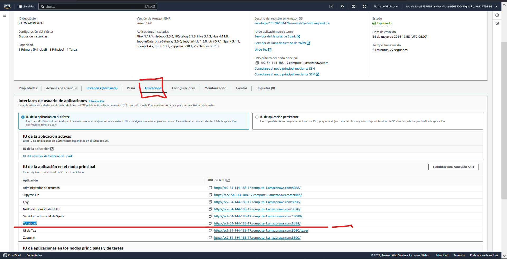

Cuando ingresamos por primera vez pide crear un usuario y contraseña. El usuario vamos a escoger `hadoop` para este lab se hace necesario este nombre.

Cuando ingresemos luego de crear la cuenta se debera ver algo como:
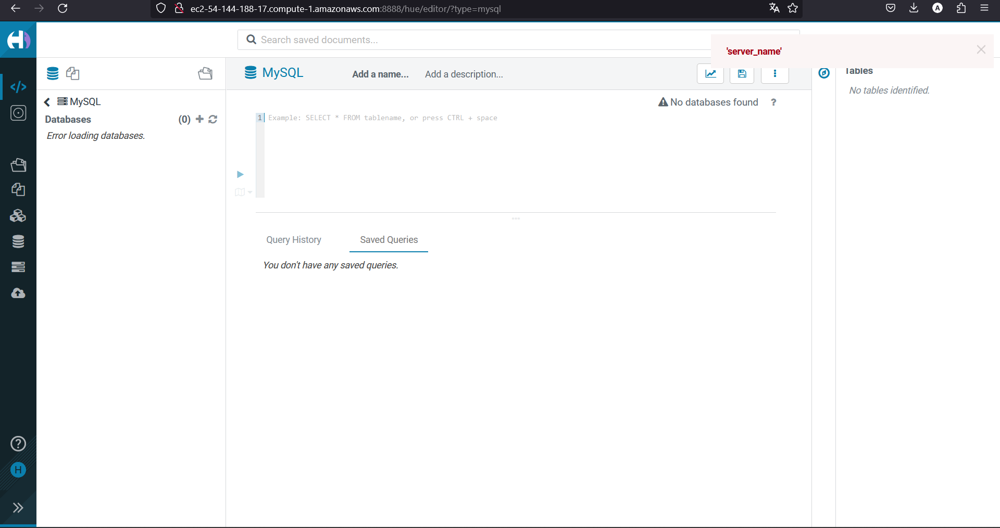

11. Si intentamos acceder al servicio Files HDFS fallara por lo cual necesitaremos la siguiente configuracion. Vamos a entrar al nodo master del cluster atraves de SSH. Cuando entremos se vera algo como:
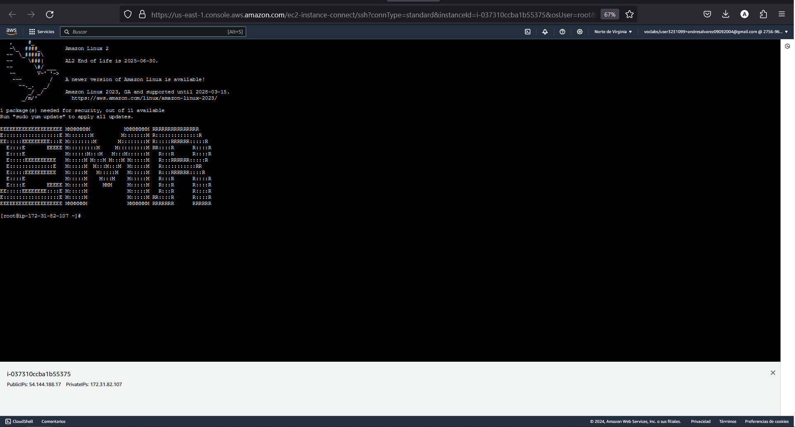
Debemos editar el archivo `hue.ini`. 
* Esto se hace mediante el siguiente comando: `nano /etc/hue/conf/hue.ini`. 
* Buscaremos una linea que contenga: `webhdfs_url` y cambiaremos el puerto de `14000` a `9870`.

  Debe verse de la siguiente forma:
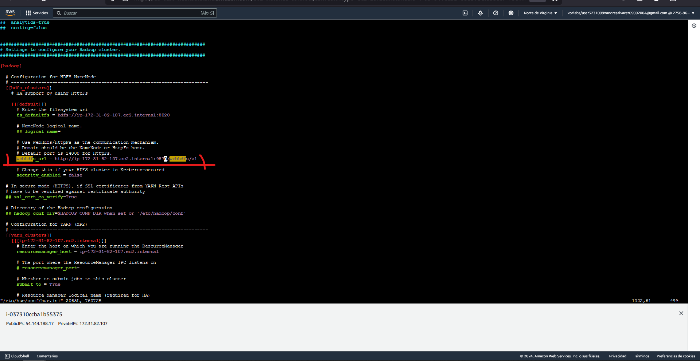
* Ahora debemos reiniciar el servicio de HUE esto se hace con `systemctl restart hue.service`.

  Con esto configurado ya podremos acceder y gestionar archivos HDFS sin problema por HUE.

12. Crearemos un bucket de S3 porque ahi vamos a guardar los archivos de los notebooks de jupyter y datasets. Para esto nos dirigimos al apartado de S3 y le daremos en crear bucket:
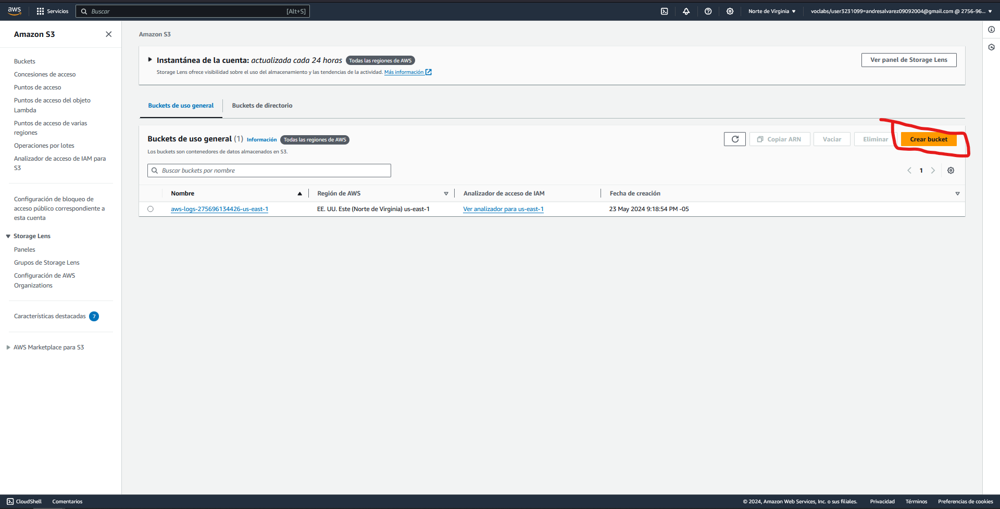

    En el nombre del bucket pondremos `camilobucket-labs-telematica` que fue el seleccionado en el paso 5.
    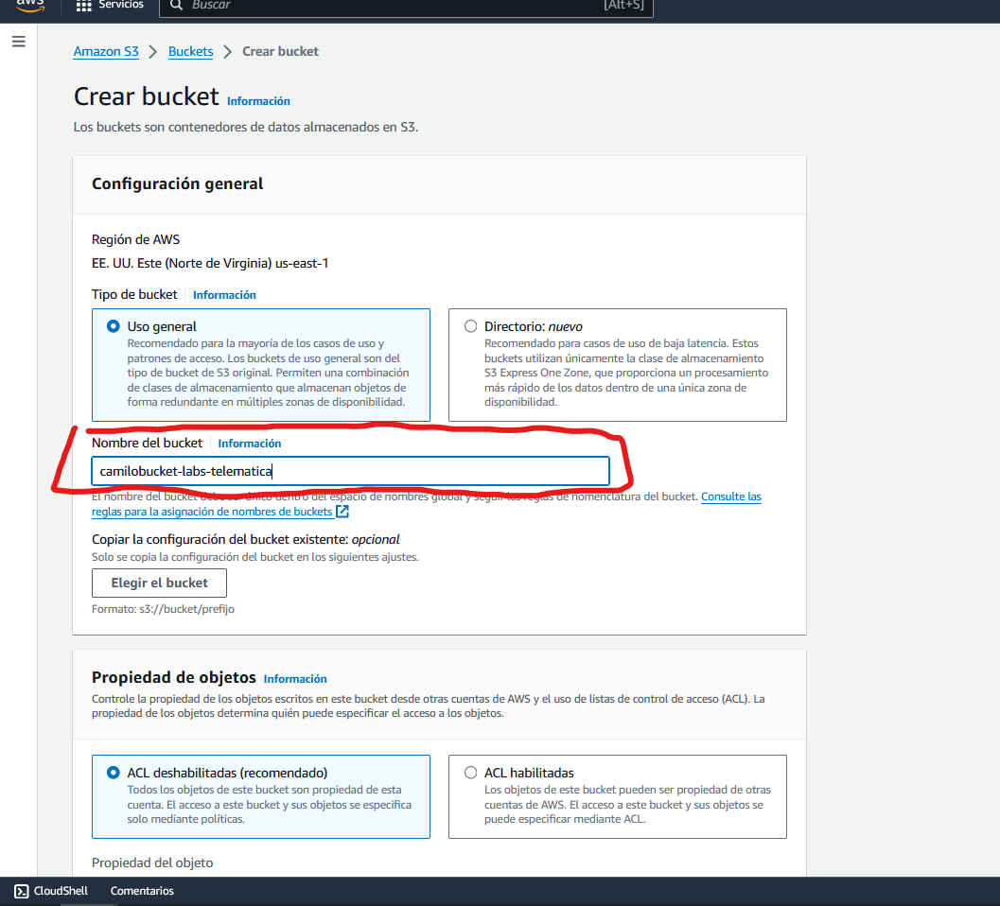
    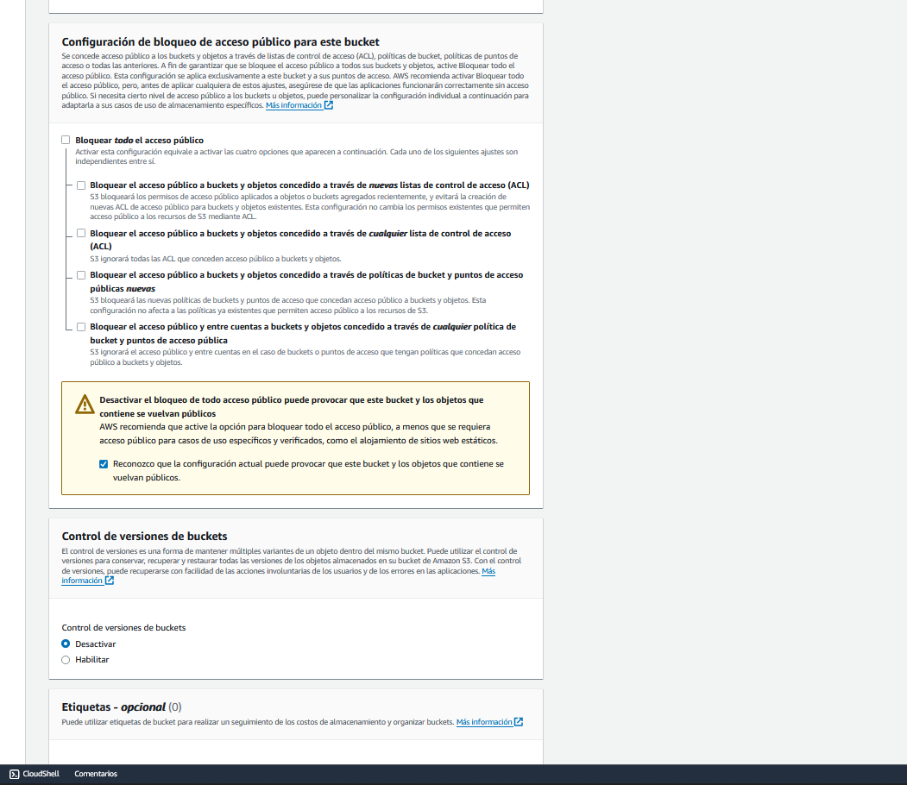

13. Ahora utilizaremos la aplicacion de jupyter notebooks para esto en el listado de aplicaciones en la aplicacion que correr en el puerto 9443 vamos a ingresar ejemplo: (http://ec2-54-144-188-17.compute-1.amazonaws.com:9443/)

    Una vez adentron nos pedira ingresar con un login, usaremos el usuario y contraña por defecto.
    ```
    Username: jovyan
    Password: jupyter
    ```

    Con esto ya podremos realizar notebooks pyspark. Sin embargo debemos verificar que las 2 variables mas importantes de contexto de spark estan activas en un notebook. Para esto debemos crear un notebook pyspark y hacer lo que se ve en la siguiente imagen:
    
    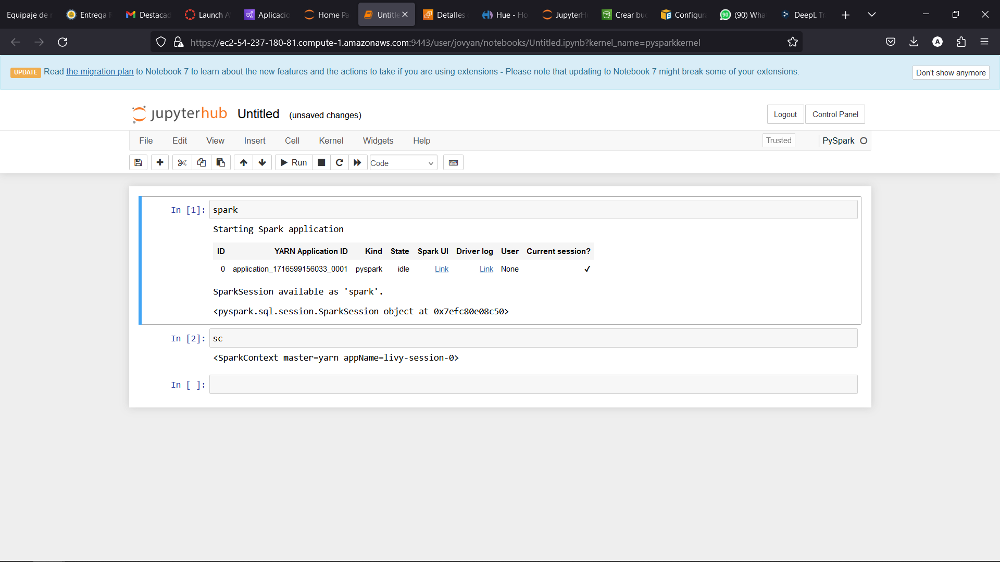