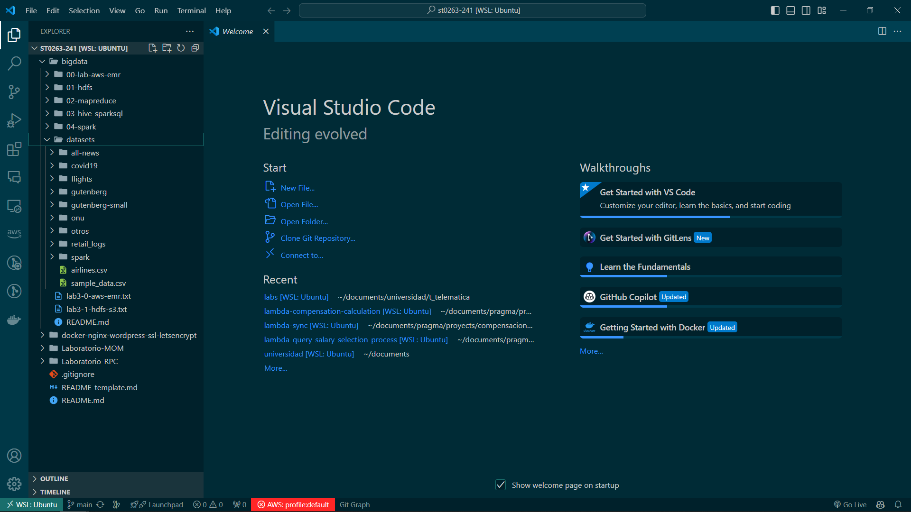
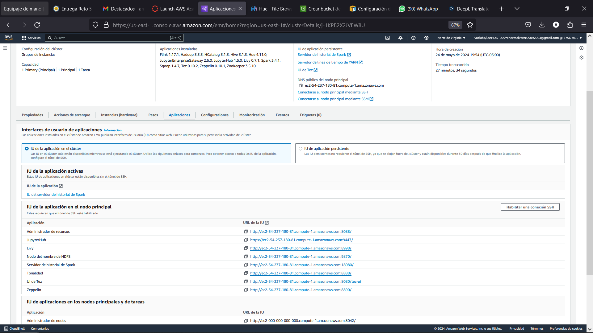
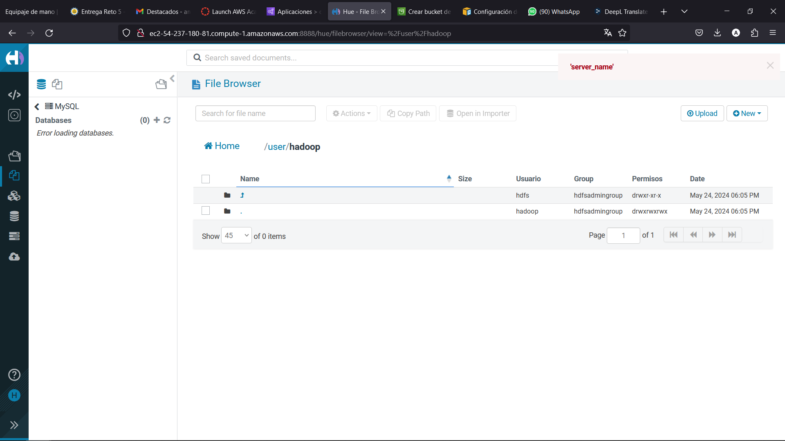
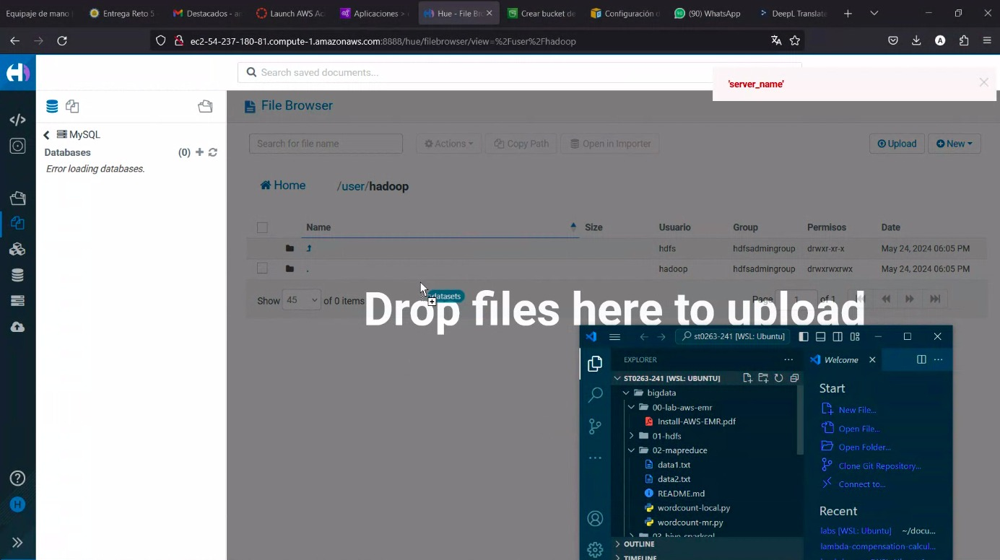
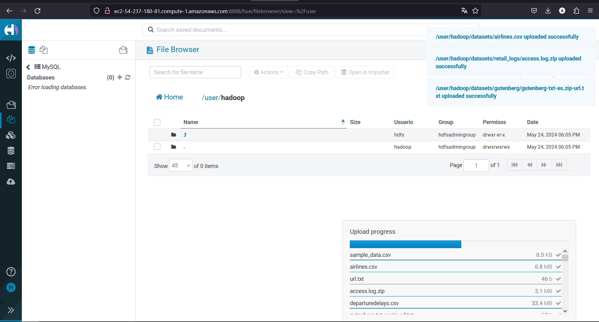
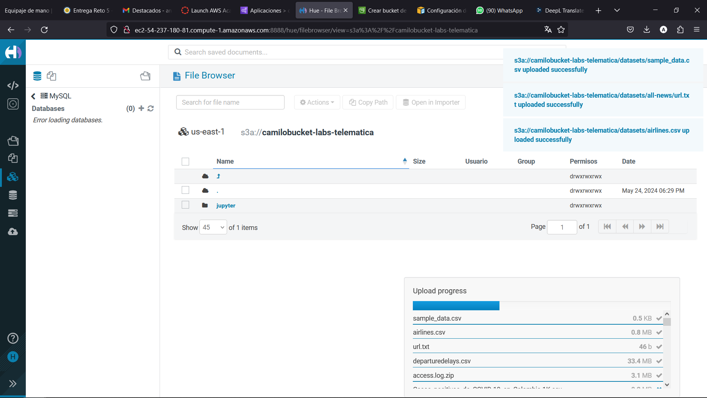
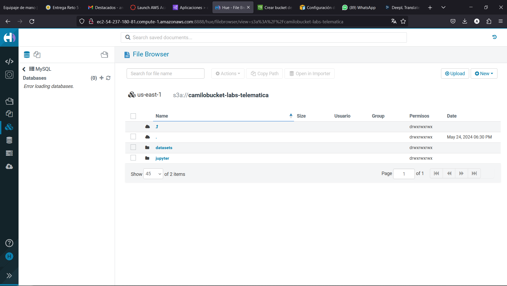

## 1. HDFS

En esta guia lo que haremos es subir el paquete de datasets que se encuentra en el siguiente repositorion de github (https://github.com/st0263eafit/st0263-241/tree/main/bigdata/datasets) a nuestro HDFS y bucket de S3. En nuestro caso el s3 nos va a persistir los datos mientras que el HDFS solo va a persistir mientras el EMR este prendido.

Lo primero que haremos es clonar el repositorio anterior.

Ahora con esto nos dirigimos a aws en nuestra instancia de clusters EMS y nos dirigimos a aplicaciones.

Ahora vamos a ingresar al cluster por Hue (Tonalidad en la version de AWS en español) esto se hace por el puerto 8888 entramos al enlace que aparece a continuacion: ejemplo (http://ec2-54-144-188-17.compute-1.amazonaws.com:8888/)

Ahora dentro de Hue nos vamos a dirigir a la seccion de File Browser. 

Ahora lo que vamos hacer es un drag and drop de la carpeta datasets que clonamos anteriormente.

Se vera una carga como la siguiente 

Esperaremos hasta que suba y veamos la carpeta subida

Se debera ver algo como la imagen anterior.

Ahora nos dirigimos al S3 y dentro del bucket que ya se creo en el laboratio 0, vamos a subir la carpeta datasets.

Hasta que se suba y se vea algo como

Ya con esto estariamos listos para proseguir con el laboratorio 2.

