## 2. Hive Spark SQL

Para la realizacion de este laboratorio debemos entrar a nuestro aplicativo de Hue con nuestras credenciasl. Si se va a trabajar con el HDFS se va necesitar copiar los datos del dataset  en el cluster AWS EMR dado que estos no son persistentes

Con lo anterior procederemos a realizar la gestion DDL y consultas DQL.

En hue seleccionamos la opcion de codigo y nos iremos por la opcion de Hive.
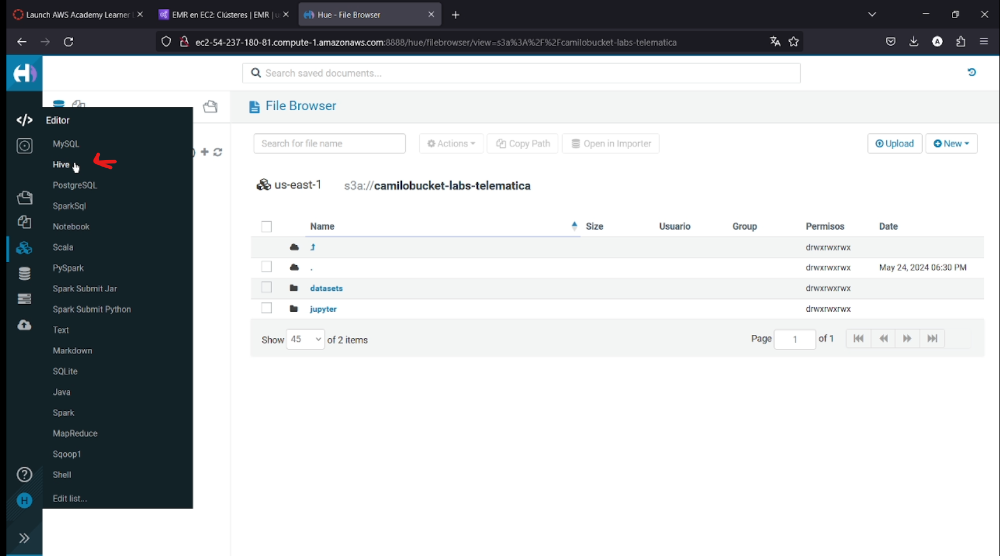

Una vez ahi en la parte del centro ejecuremos el siguiente codigo para crear la tabla
```sql
use usernamedb;
CREATE TABLE HDI (id INT, country STRING, hdi FLOAT, lifeex INT, mysch INT, eysch INT, gni INT) 
ROW FORMAT DELIMITED FIELDS TERMINATED BY ','
STORED AS TEXTFILE
```
Se debera ver algo como:
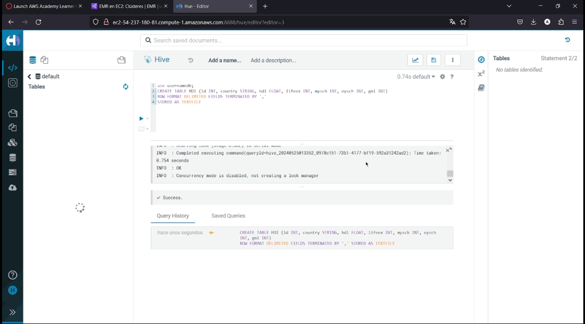

Indicandonos que la creacion fue exitosa.
```sql
SELECT * FROM HDI;
```
En este punto no deberia mostrar nada ya que no hay datos en la tabla.

Si nos vamos a hdfs en la ruta que se evidencia en la siguiente imagen debera verse la tabla que creamos con anterioridad.
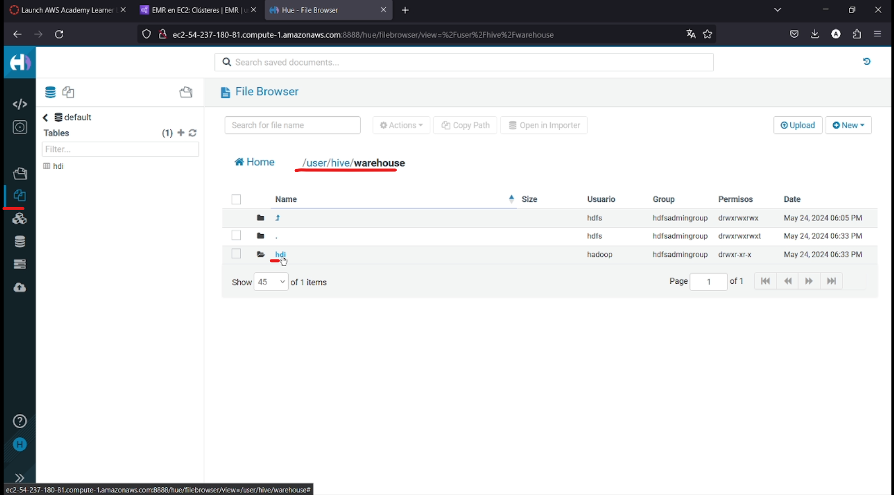

Dentro de la carpeta HDI se debera agregar el archivo hdi-data.csv que contiene los datos a cargar en la tabla.
Este archivo se encuentra en el siguiente link (https://github.com/st0263eafit/st0263-241/blob/main/bigdata/datasets/onu/hdi-data.csv).

Una vez se suba el archivo podemos comprobar realizando la siguiente consulta en Hive.
```sql
SELECT * FROM HDI;
```
Nos debe salir algo como:
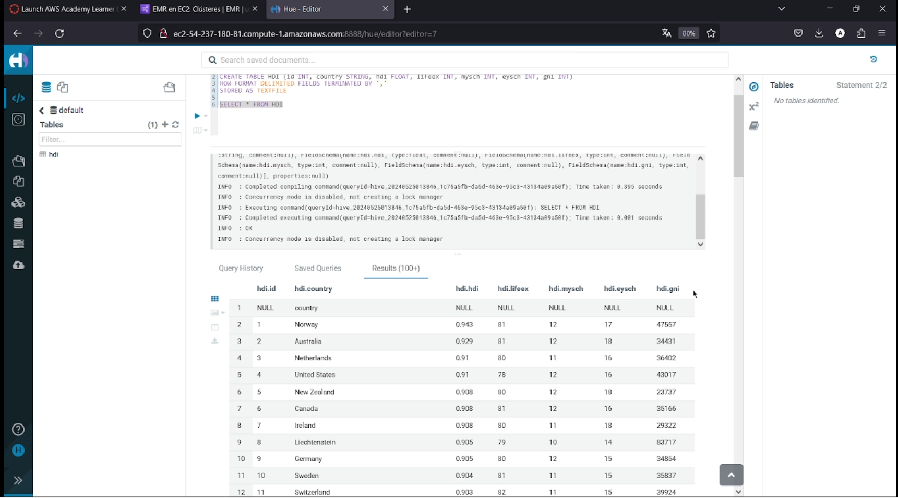
Esto nos indica que los datos fueron cargados a la tabla.

Ahora vamos a realizar lo mismo pero con el S3.
Dado que el S3 es persisten se necesita indicarle una locacion para que guarde los datos.
Otra cosa a tener en cuenta es que el location ya debe extistir en el S3, en el laboratorio 1 hicimos la subida del paquete HDI el cual ya tiene la ruta que vamos a usar.

Ahora en Hive vamos a ejecutrar el siguiente comando 
```sql
CREATE EXTERNAL TABLE HDI2 (id INT, country STRING, hdi FLOAT, lifeex INT, mysch INT, eysch INT, gni INT) 
ROW FORMAT DELIMITED FIELDS TERMINATED BY ',' 
STORED AS TEXTFILE 
LOCATION 's3://camilobucket-labs-telematica/datasets/onu/hdi/'
```

En este punto ya deberiamos tener la tabla creada en el S3. 
Asi se deberia ver una vez se cree la tabla.
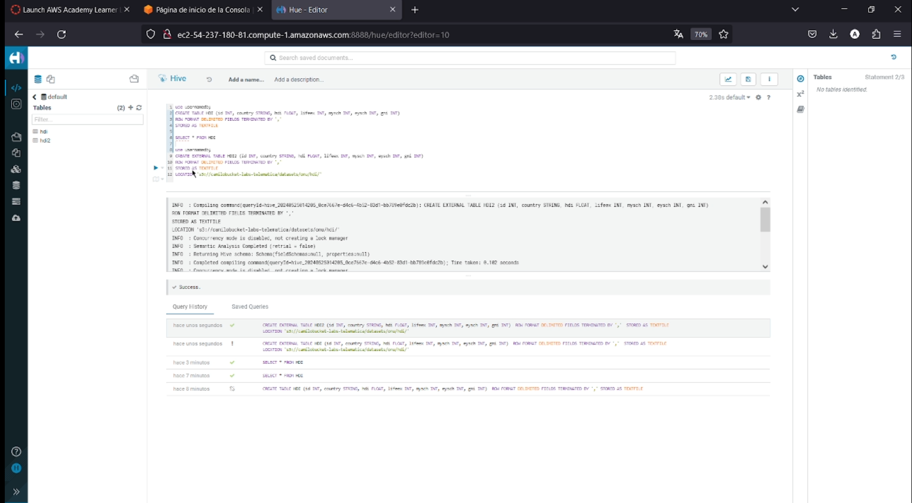

Con esto ya deberiamos poder correr un select en la tabla HDI2 y ver los datos.
```sql
SELECT * FROM HDI2;
```

Ahora para verificar vamos a correr los siguiente comando con un ambito educativo

```sql
show tables;
```
Se deberia ver la siguiente salida:
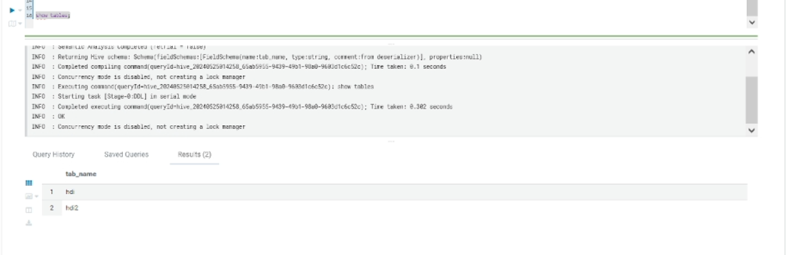

```sql
describe hdi;
describe hdi2;
```
Para ambas tablas deberia salir algo como:
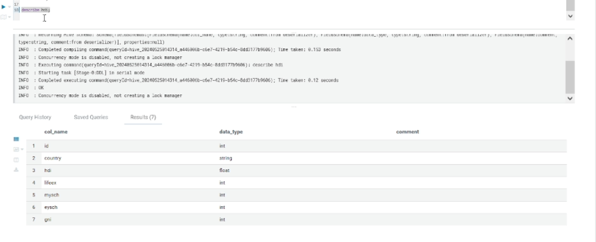


```sql
select country, gni from hdi where gni > 2000; 
```
Deberia salir algo como:
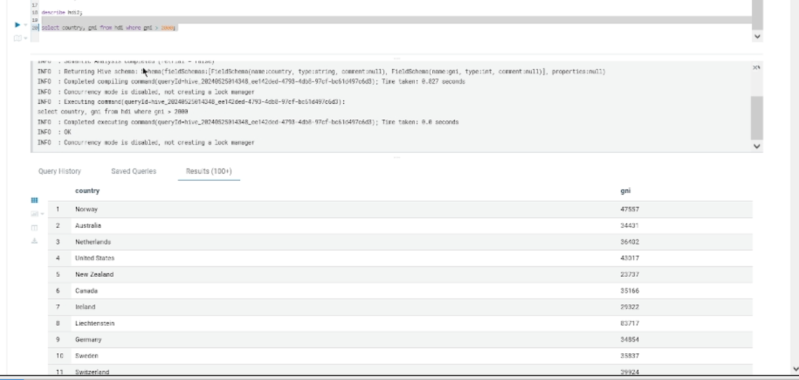

Listo, ahora creamos otra tabla desde otro archivo, esto porque lo que queremos hacer es un JOIN entre dos tablas, una que esta en el HDFS y otra que esta en el S3.
Para esto usaremos la siguiente sentencia:
```sql
CREATE EXTERNAL TABLE EXPO (country STRING, expct FLOAT) 
ROW FORMAT DELIMITED FIELDS TERMINATED BY ',' 
STORED AS TEXTFILE 
LOCATION 's3://camilobucket-labs-telematica/datasets/onu/export/'
```
Debemos ver que se ejecuto de manera exitosa con el mensaje de sucess
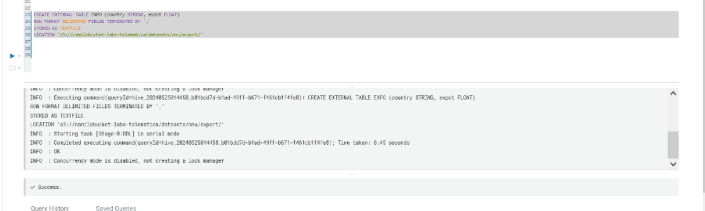

Ahora vamos a realizar el JOIN entre las dos tablas.
```sql
SELECT h.country, gni, expct FROM HDI h JOIN EXPO e ON (h.country = e.country) WHERE gni > 2000;
```
Este si sera un poco mas lento dado a la cantidad de datos.


Con esto quedariamos listos haciendo consultas en Hive.

Ahora vamos a realizar otra aproximacion haciendo un wordcount en HIVE

### Wordcount HIVE

Para esto ejecutaremos el siguiente comando:
```sql
CREATE EXTERNAL TABLE docs (line STRING) 
STORED AS TEXTFILE 
LOCATION 's3://camilobucket-labs-telematica/datasets/gutenberg-small/';
```

Con esto ya deberiamos tener la tabla creada en el S3.

Ahora vamos a realizar un ordenado por palabras

```sql
SELECT word, count(1) AS count FROM (SELECT explode(split(line,' ')) AS word FROM docs) w 
GROUP BY word 
ORDER BY word DESC LIMIT 10;
```

Se deberia ver algo como:
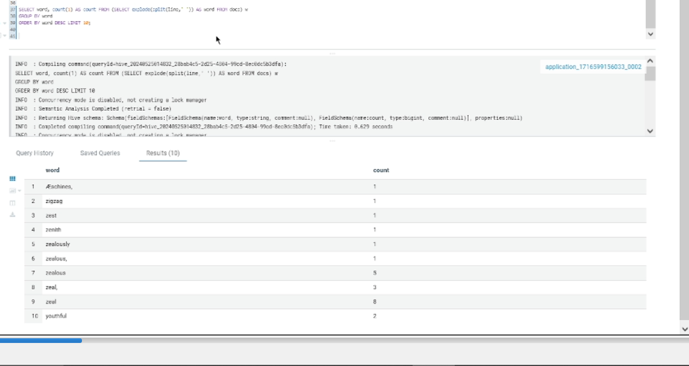

Y ahora ejecutaremos un ordenado por frecuencia de menor a mayor
```sql
SELECT word, count(1) AS count FROM (SELECT explode(split(line,' ')) AS word FROM docs) w 
GROUP BY word 
ORDER BY count DESC LIMIT 10;
```
Se deberia ver algo como:
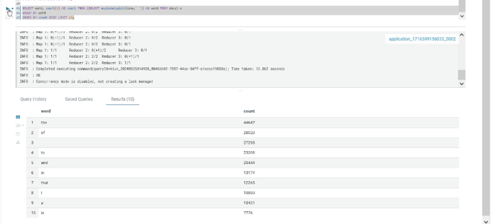


Ahora como reto tenemos lo siguiente `¿cómo llenar una tabla con los resultados de un Query? por ejemplo, como almacenar en una tabla el diccionario de frecuencia de palabras en el wordcount?`
Para esto en el S3 en la carpeta de `datasets` deberemos crear una carpeta llamada `wordcount-lab2-results` aqui es donde ira la tabla que crearemos a continuacion.

Para esto vamos a realizar lo siguiente:
```sql
CREATE EXTERNAL TABLE wordcounts3 (
  word STRING,
  count INT
)
STORED AS TEXTFILE
LOCATION 's3://camilobucket-labs-telematica/datasets/wordcount-lab2-results/';

INSERT OVERWRITE TABLE wordcounts3
SELECT word, count FROM (
  SELECT word, count(1) AS count 
  FROM (
    SELECT explode(split(line, ' ')) AS word 
    FROM docs
  ) w 
  GROUP BY word 
  ORDER BY count DESC 
  LIMIT 10
) subquery;

SELECT * FROM wordcounts3;
```

Deberemos ver algo como:
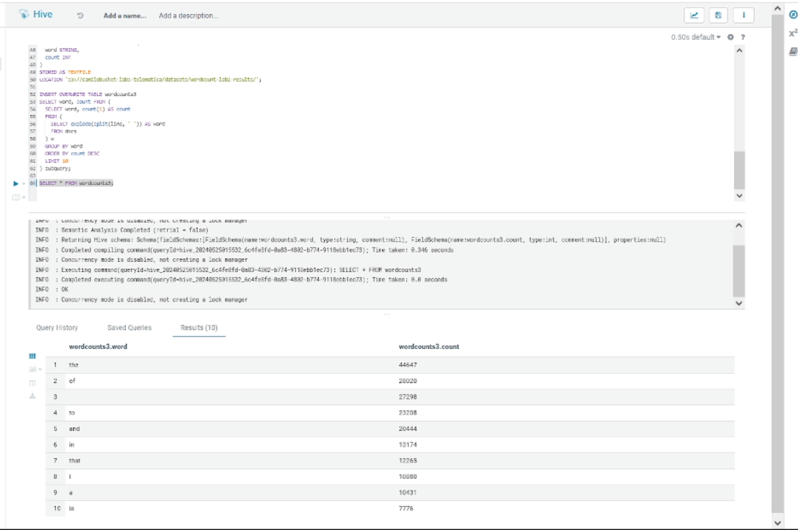

Con esto finalizamos el laboratorio 2 de Hive Spark SQL.

