## Laboratorio 3

En este laboratorio vamos a ejecutar en jupyter todo un notebook, esto en AWS. Luego en google colab vamos a ejecutar el mismo notebook.
Esto con el fin de conocer las diferencias entre los dos servicios.

Para comenzar continuaremos tomando como base los laboratorios anteriores. 

Entonces en Hue entraremos al S3.
Y nos dirigiremos a la siguiente carpeta.
`s3://camilobucket-labs-telematica/jupyter/jovyan/`
Una vez alli vamos a subir el archivo `Data_processing_using_PySpark.ipynb` que se encuentra en el siguiente link. 
(https://github.com/st0263eafit/st0263-241/blob/main/bigdata/04-spark/Data_processing_using_PySpark.ipynb)

Para eso primero lo descargamos en nuestra maquina local y luego lo subimos al S3.
Debera quedar algo de la siguiente forma:
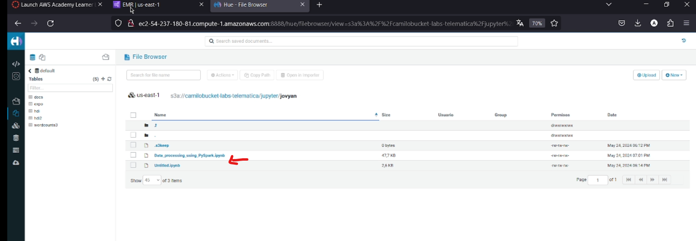

Con esto listo ahora nos dirigiremos a jupyter a traves de las aplicaciones de nuestro cluster de EMR.

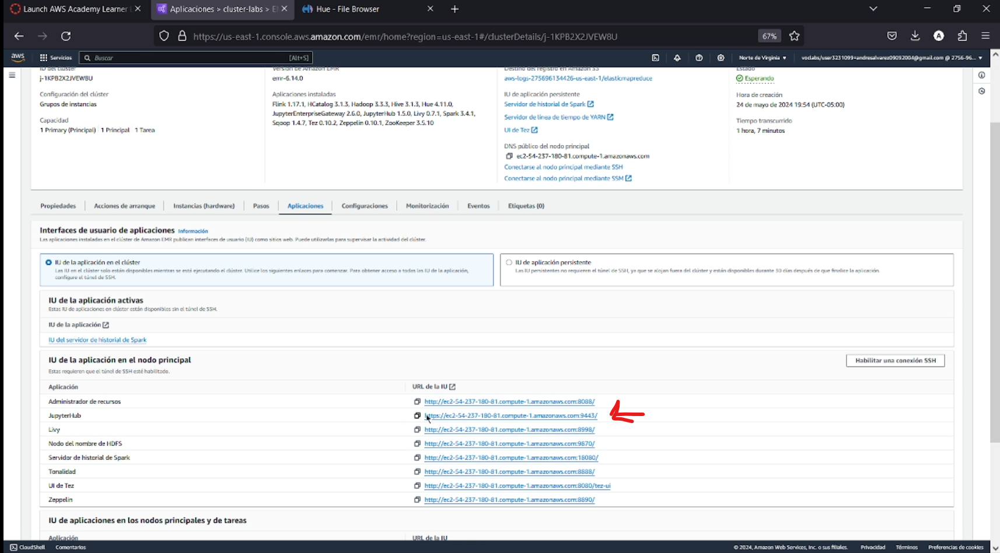
Entraremos al link del puerto `9443`.
Una vez dentro nos loguearemos con las siguientes credenciales por defecto.
```
JUPYTER_USERNAME=jovyan
JUPYTER_PASSWORD=jupyter
```
Una vez dentro veremos algo como:
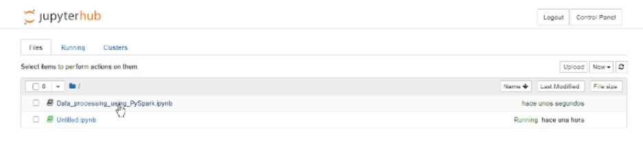
Y abriremos el archivo `Data_processing_using_PySpark.ipynb` que subimos anteriormente.

Se vera algo como esto:
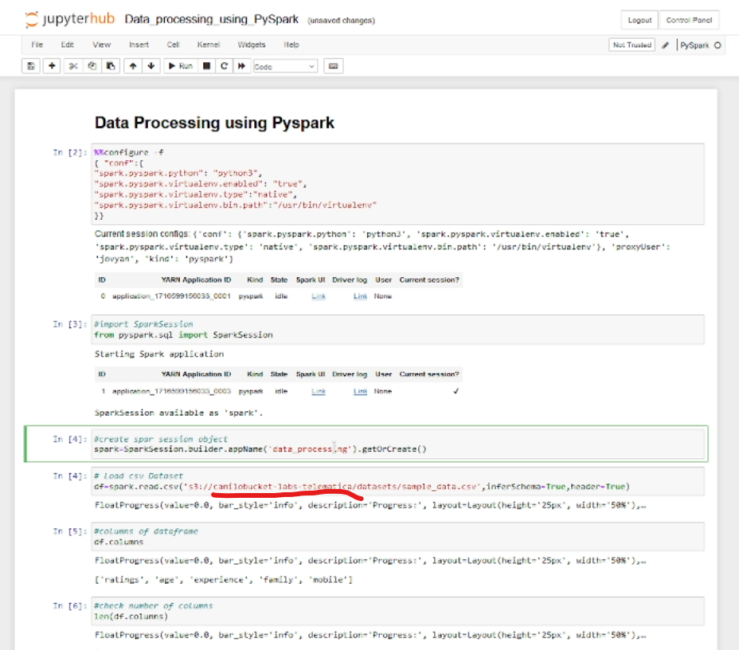
En el punto que se subraya se debe poner el bucket del s3 que se esta utilizando.

Ahora ejecutaremos cada una de las celdas evidenciando los resultados.

Se adjuntaran los resultados
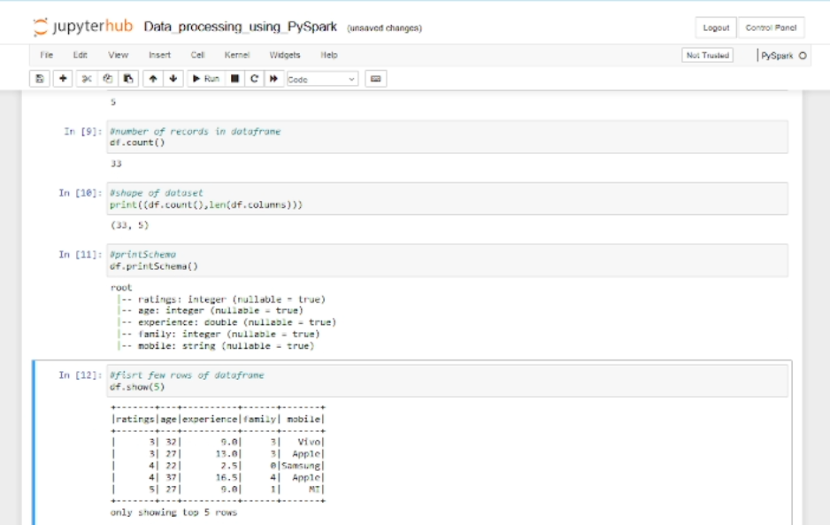
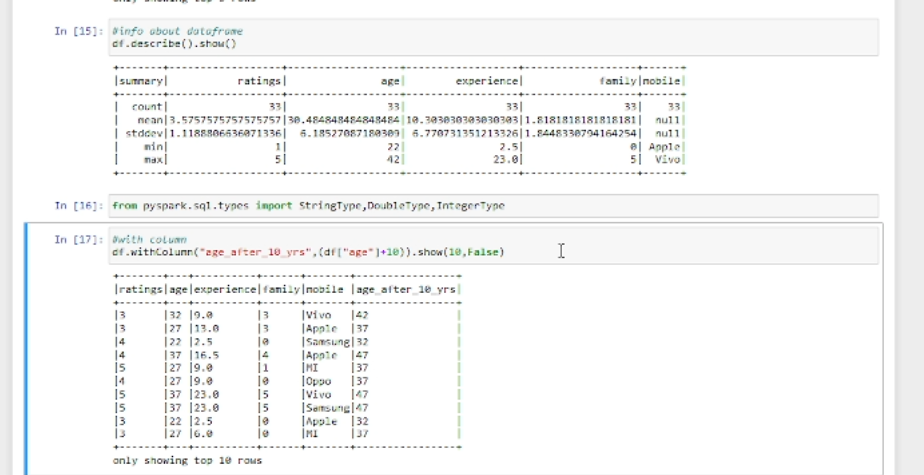
Ejecutaremos todas las celdas y veremos los resultados, por temas practicas no se adjuntaran todos los resultados.

Al final tambien deberemos hacer unos cambios en el codigo para poner muestro bucket de s3.
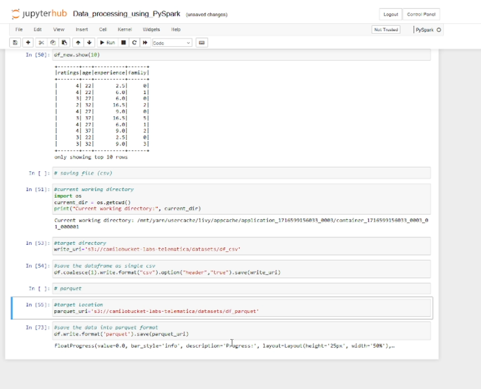

Con esto ya estariamos listos por el lado de AWS usando Jupyter ahora podremos pasar al uso de Google Colab.

### Google Colab

Para google colab no es necesario hacer nada en especial, solo entrar al siguiente link. (https://colab.research.google.com/)

Iniciar sesion y crear un nuevo notebook.
Debemos ver algo como :
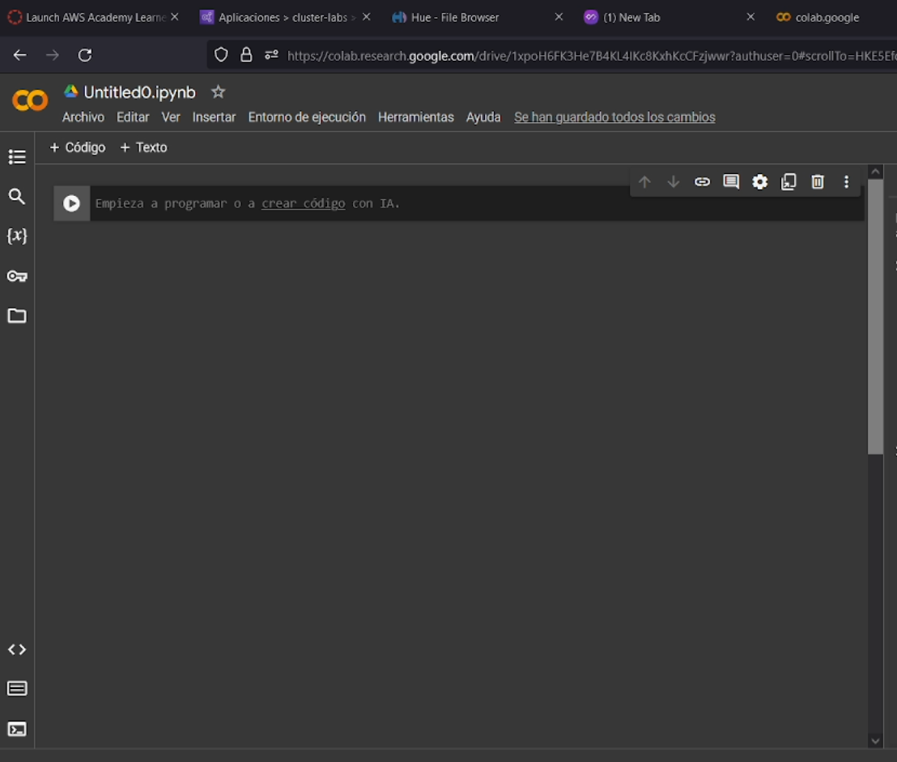

Ahora lo que vamos hacer es subir el siguiente archivo de la siguiente forma.
Le daremos en archivo y subir notebook.
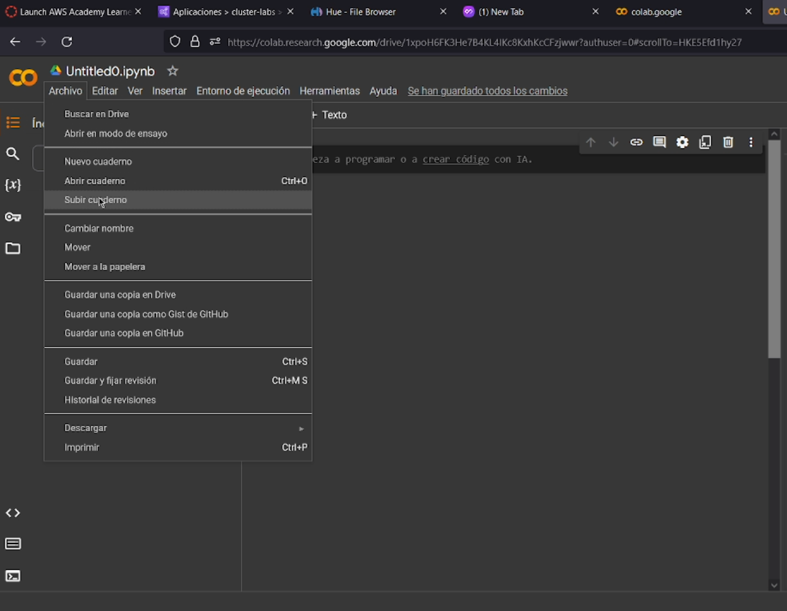
Subiremos el archivo (https://github.com/st0263eafit/st0263-241/blob/main/bigdata/04-spark/Data_processing_using_PySpark_google_colab.ipynb)
Una vez se suba se se abrira automaticamentes y se vera algo como:
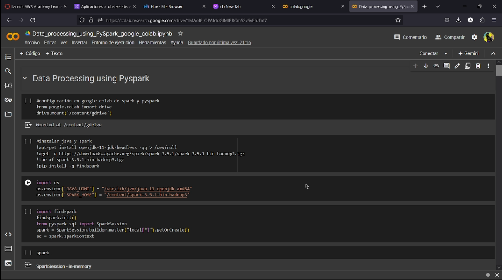

Aqui debemos empezar a correr las celdas y ver los resultados.
Una vez lleguemos a la celda que dice esto
`df=spark.read.csv('gdrive/MyDrive/st0263-241/bigdata/datasets/sample_data.csv',inferSchema=True,header=True)` debemos subir el dataset a colab.
Esto se hace yendo a la carpeta de archivos en el folder `MyDrive` debemos crear el folder datasets y subir el archivo `sample_data.csv` que se encuentra en el siguiente link. (https://github.com/st0263eafit/st0263-241/blob/main/bigdata/datasets/sample_data.csv)
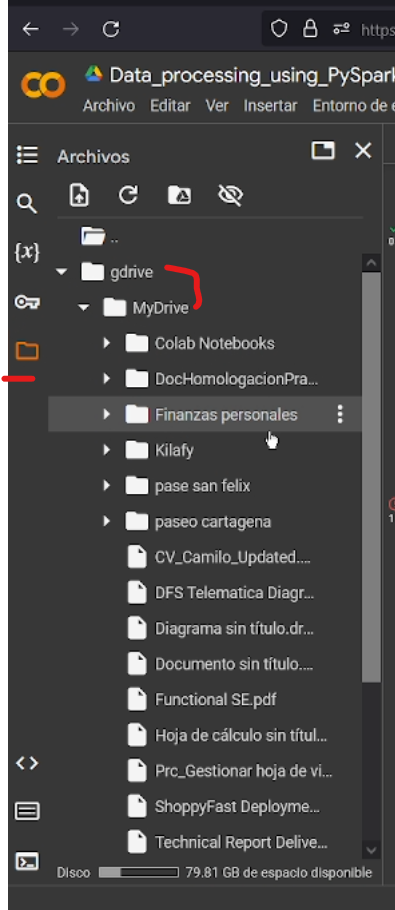
Una vez se haga esto se podra correr la celda y ver los resultados. Se debera ver asi el archivo subido y la celda corrida.
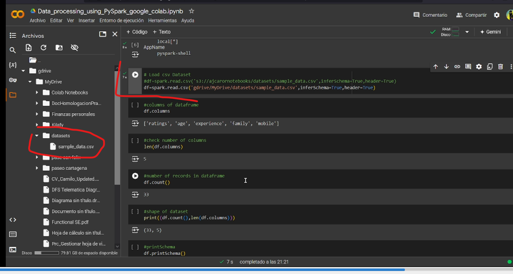

Ya en este punto seria correr el resto del collab y una vez se tenga el resultado final se podra comparar con el de AWS.

Con esto ya se habria terminado el laboratorio 3.

